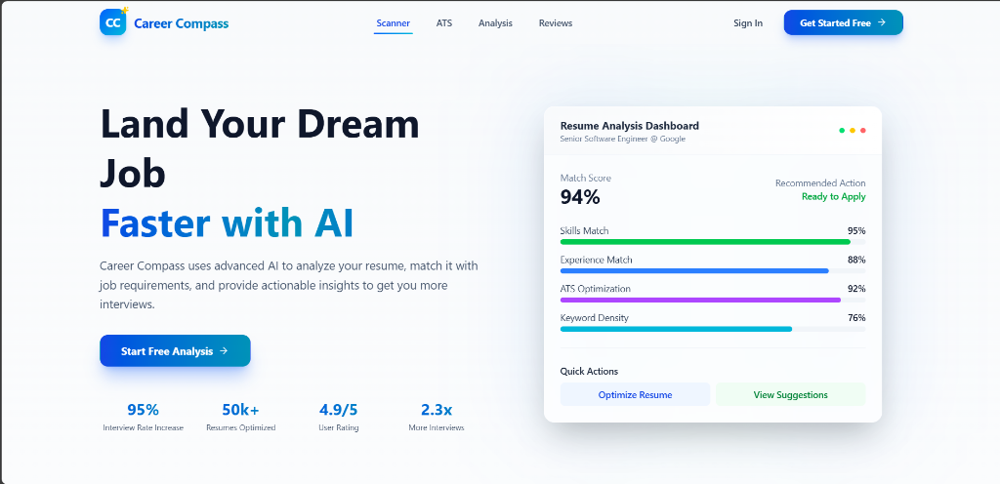
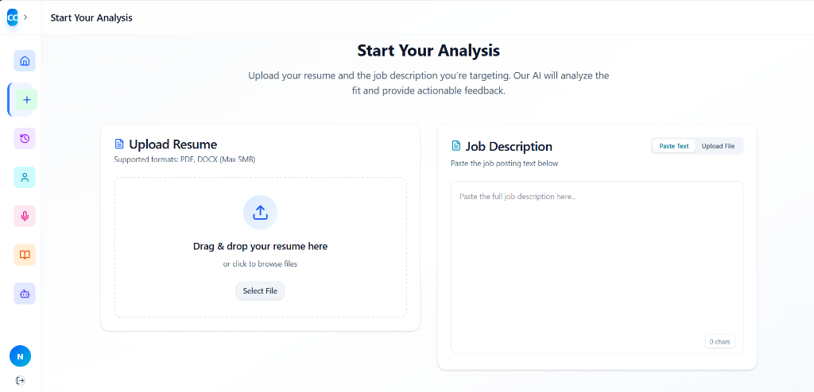
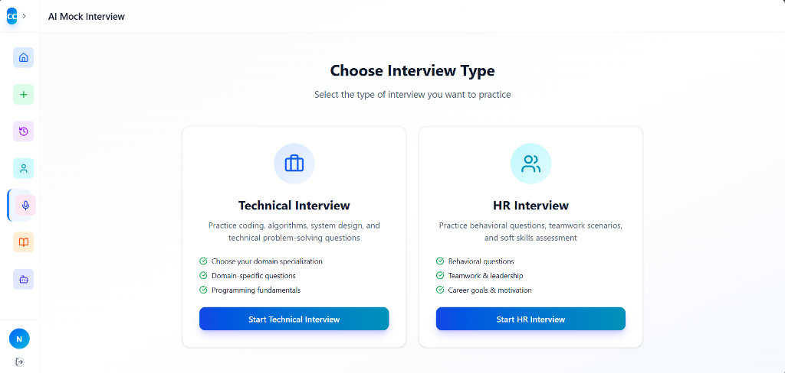
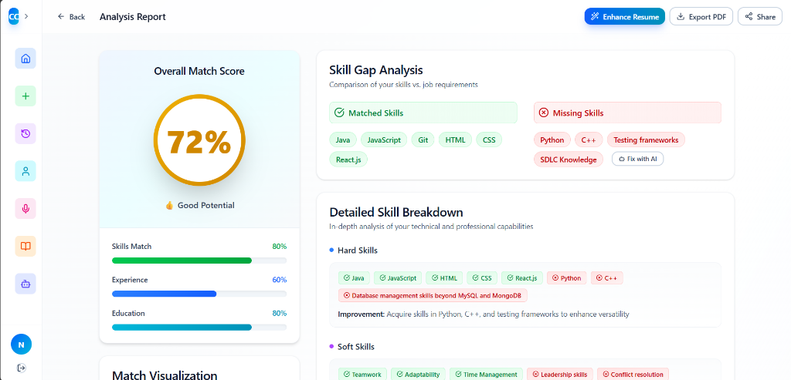
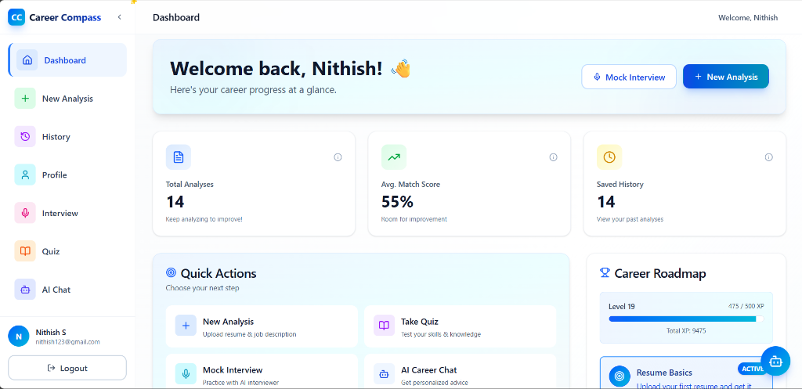

# Career Compass (Delta Forge) 🚀

**Career Compass** is an advanced AI-powered career support platform designed to assist job seekers at every stage of their journey. By integrating cutting-edge AI tools, it provides personalized resume analysis, simulated mock interviews, and tailored career roadmaps to help users land their dream jobs.



## 📸 Screenshots

| **Interactive Dashboard** | **Intelligent Analysis** |
|:---:|:---:|
|  |  |
| Track your progress and recent activity | Upload resume to get instant feedback |

| **AI Mock Interviews** | **Visual Insights** |
|:---:|:---:|
|  |  |
| Practice with AI-driven technical questions | Clear visualization of your skills match |

## ✨ Key Features

- **📄 AI Resume Analysis**: Upload your resume and a job description to get a detailed match score, missing skills analysis, and actionable improvement tips.
- **🎙️ AI Mock Interview**: Practice technical or behavioral interviews with an AI that simulates a real recruiter, providing real-time feedback and sample answers.
- **🗺️ Career Roadmap**: meaningful visual learning paths tailored to your current skills and career goals.
- **💬 AI Career Coach**: A 24/7 chat assistant to answer career queries, help with application strategies, or guide you through the platform.
- **📊 Progress Tracking**: Dashboard analytics to track your match scores over time and gamified XP system to keep you motivated.
- **🔐 Secure Profile**: Manage your history, save reports, and track your professional growth securely.

## 🛠️ Tech Stack

### Frontend
- **Framework**: React 19 (Vite)
- **Styling**: Tailwind CSS 4, Framer Motion (Animations)
- **Charts**: Recharts
- **Icons**: Lucide React

### Backend
- **Runtime**: Node.js & Express.js 5
- **Database**: MongoDB (Mongoose 9)
- **AI Integration**: Groq API (Llama-3.3-70b-versatile)
- **File Processing**: PDF-Parse, Mammoth, Puppeteer (PDF Generation)
- **Authentication**: JWT & Bcrypt

## 🚀 Getting Started

Follow these instructions to set up the project locally on your machine.

### Prerequisites
- **Node.js**: v18 or higher
- **MongoDB**: Installed locally or a cloud URI (MongoDB Atlas)
- **Groq API Key**: Get a free key from [console.groq.com](https://console.groq.com)

### Installation

1.  **Clone the Repository**
    ```bash
    git clone https://github.com/yourusername/career-compass.git
    cd career-compass
    ```

2.  **Install Dependencies**
    You need to install dependencies for both the frontend and backend.
    ```bash
    # Install Backend Dependencies
    cd backend
    npm install

    # Install Frontend Dependencies
    cd ../frontend
    npm install
    ```

### ⚙️ Environment Configuration

Create a `.env` file in the **`backend`** directory (`backend/.env`) with the following variables:

```env
# backend/.env

PORT=5000
MONGODB_URI=mongodb://localhost:27017/career_compass
# OR your MongoDB Atlas URI

JWT_SECRET=your_secure_jwt_secret_key
GROQ_API_KEY=gsk_your_groq_api_key_here
```

> **Note:** The frontend runs on Vite and usually doesn't require a `.env` file unless you have specific client-side configs.

### ▶️ Running the Application

You need to run both the backend server and the frontend client.

1.  **Start Backend** (Terminal 1)
    ```bash
    cd backend
    npm start
    ```
    *Output should say: "Server is running on port 5000" and "MongoDB Connected"*

2.  **Start Frontend** (Terminal 2)
    ```bash
    cd frontend
    npm run dev
    ```
    *This will launch the app at `http://localhost:5173`*

3.  **Open in Browser**
    Visit `http://localhost:5173` to start using Career Compass!

## 🧪 Troubleshooting

-   **"Invalid API Key" Error:**
    Ensure your `GROQ_API_KEY` in `backend/.env` is correct. If you changed it, strictly restart the backend server (`Ctrl+C` -> `npm start`).

-   **Port 5000 Already in Use:**
    If you see `EADDRINUSE`, an old server process might be running. Kill it using Task Manger or `taskkill /F /IM node.exe` (Windows).

-   **Database Connection Fail:**
    Ensure your local MongoDB service is running (`mongod`) or your Atlas URI is whitelisted.

## 🤝 Contributing

Contributions are welcome! Please feel free to submit a Pull Request.

## 📄 License

This project is open-source and available under the [MIT License](LICENSE).
